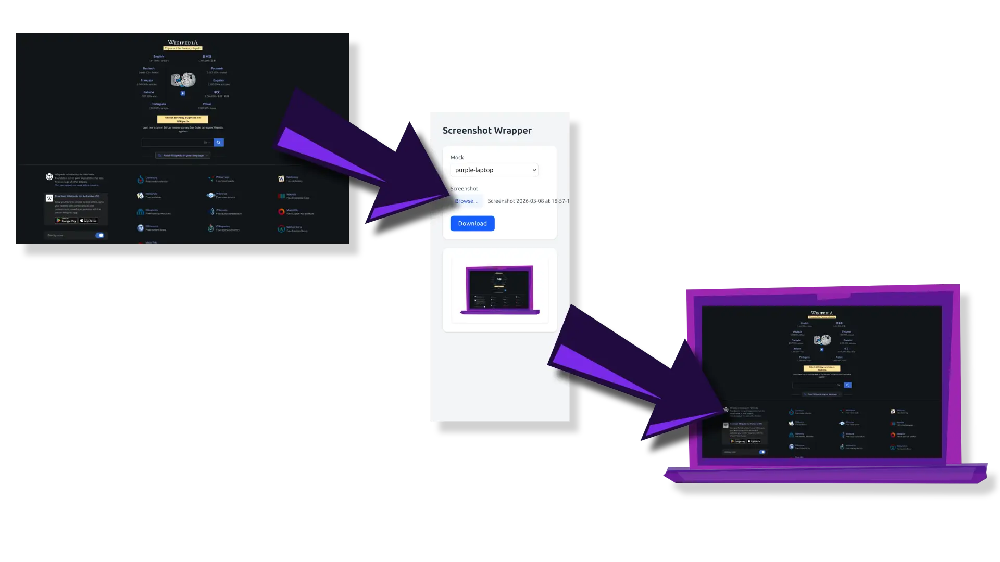

# Screenshot Wrapper

**Quickly wrap screenshots into mockup templates.**

## Architecture

- CDN-based single-file Vue app
- lucide+tailwind
- mock options defined in `mocks/` with a simple custom spec

## Running It

- *in theory, we can simply open `index.html` in a browser, but usually this leads to trouble with loading the required data in `mocks/`*
- thus, a simple web server is recommended; on Ubuntu I simply run `python3 -m http.server 8081` and open the URL

## Misc

- Use [this border-image-generator](https://developer.mozilla.org/en-US/docs/Web/CSS/Guides/Backgrounds_and_borders/Border-image_generator) to get the data for top/right/bottom/left