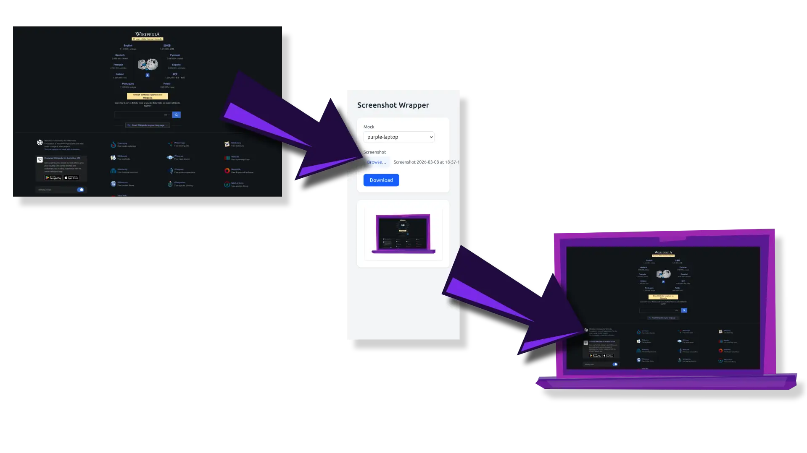

# Screenshot Wrapper

**Quickly wrap screenshots into mockup templates.**

## Architecture

- CDN-based single-file Vue app
- lucide+tailwind
- mock options defined in `mocks/`: each mock is a single self-contained SVG in `mocks/img/`, listed by filename in `mocks/list.txt`

## Running It

- *in theory, we can simply open `index.html` in a browser, but usually this leads to trouble with loading the required data in `mocks/`*
- thus, a simple web server is recommended; on Ubuntu I simply run `python3 -m http.server 8081` and open the URL

## Adding a mock

A mock is just an SVG. To mark where a screenshot goes, fill a `<rect>` (or `<polygon>`) in the SVG with pure green, `#00ff00` — the app detects it automatically and never renders it:

- **One green shape** → classic single-device mockup. The frame grows/shrinks to fit whatever the user uploads, 9-slicing the border around it.
- **Two or more green shapes** → a fixed multi-device layout. The canvas stays the mock's native size, and each upload is cropped (`cover` fit) to fill its own shape. Give each shape an `id` attribute if you want stable slot labels (e.g. `id="left"`); otherwise slots are auto-numbered in reading order.

The dropdown name is just the filename, unslugged (dashes/underscores → spaces, title-cased). Then add the filename to `mocks/list.txt`.